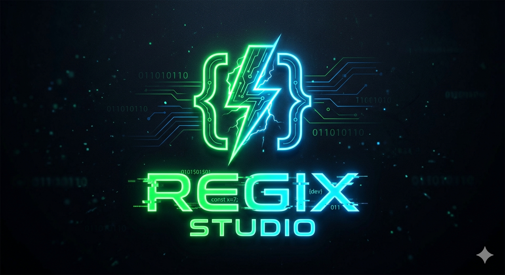

# 🩸 REGIX Studio

<div align="center">
  
  
  **Advanced Gaming Solutions Panel**
  
  [](https://www.python.org/)
  [](https://flask.palletsprojects.com/)
  [](LICENSE)
</div>

---

## 📋 Table of Contents

- [Overview](#overview)
- [📁 Project Structure](#project-structure)
- [🚀 Quick Start](#quick-start)
- [🎮 Features](#features)
- [⚙️ Configuration](#configuration)
- [🧠 AimbotAI (Silent Aim)](#aimbotai-silent-aim)
- [🔧 Commands](#commands)
- [🧩 AOB Patterns](#aob-patterns)
- [⚠️ Disclaimer](#disclaimer)

---

## Overview

REGIX Studio is a comprehensive gaming enhancement panel featuring:

- 🔫 **Aimbot** - Automatic aiming assistance
- 🎯 **Silent Aim** - Memory-based hitbox redirection
- 🖱️ **Aim Drag** - Recoil control system
- 🎨 **Modern UI** - Dark blood-themed interface with animations

---

## 📁 Project Structure

```
streamer-panel/
├── 📁 templates/           # Jinja2 HTML templates
│   ├── 📄 base.html       # Base template with blood theme
│   ├── 📄 dashboard.html  # Main dashboard
│   ├── 📄 homepage.html   # Login page
│   ├── 📄 sniper.html     # Sniper mode page
│   ├── 📄 extra.html      # Extra features page
│   └── 📁 partials/       # Reusable components
│       ├── 📄 status.jinja
│       ├── 📄 emulator.jinja
│       ├── 📄 tabs.jinja
│       ├── 📄 headshot.jinja
│       ├── 📄 sniper.jinja
│       ├── 📄 settings.jinja
│       └── 📄 console.jinja
│
├── 📁 static/            # Static assets
│   ├── 📁 images/
│   │   └── 📄 logo.png
│   └── 📁 js/            # JavaScript files
│       ├── 📄 homepage.js
│       ├── 📄 status.js
│       ├── 📄 console.js
│       ├── 📄 headshot.js
│       ├── 📄 extra.js
│       ├── 📄 sniper.js
│       └── 📄 emulator.js
│
├── 📁 REGIX_Studio/      # Build output folder
│   ├── 📁 build/
│   └── 📄 *.spec files
│
├── 📄 app.py              # Main Flask application
├── 📄 Memory.py           # Memory manipulation & AimbotAI
├── 📄 utils.py            # Utility functions
├── 📄 keyauth.py          # Authentication handler
├── 📄 requirements.txt   # Python dependencies
├── 📄 LICENSE
└── 📄 README.md
```

---

## 🚀 Quick Start

### Prerequisites
- Python 3.x
- Windows OS (for memory manipulation)

### Installation

```bash
# Clone the repository
git clone https://github.com/regixstudio/streamer-panel.git
cd streamer-panel

# Install dependencies
pip install -r requirements.txt

# Run the application
python app.py
```

### Build Executable

```bash
# Build using PyInstaller
pyinstaller REGIX_Studio.spec
```

---

## 🎮 Features

| Feature | Description | Endpoint |
|---------|-------------|----------|
| 🔐 Login | User authentication | `POST /auth` |
| 📊 Status | Check process status | `POST /get-process` |
| 🎯 Aimbot Load | Initialize aimbot | `POST /aimbot-load` |
| 🔫 Aimbot Enable | Activate aimbot | `POST /aimbot-on` |
| 🚫 Aimbot Disable | Deactivate aimbot | `POST /aimbot-off` |
| 🖱️ Aim Drag Load | Initialize drag system | `POST /aimdrag-load` |
| 🎯 Aim Drag Enable | Activate drag | `POST /aimdrag-on` |
| 🚫 Aim Drag Disable | Deactivate drag | `POST /aimdrag-off` |
| 🔍 Sniper Scope | Scope enhancement | `POST /sniper-scope-on` |
| 🔄 Sniper Switch | Switch aiming mode | `POST /sniper-switch-on` |
| 🎨 Chams Menu | Visual enhancements | `POST /chams-menu` |
| 🧊 Chams 3D | 3D wallhack | `POST /chams-3D` |
| 📦 M82B ESP | Enemy ESP | `POST /m82b-esp-on` |

---

## ⚙️ Configuration

Configure in `app.py`:

```python
keyauthapp = api(
    name = "REGIX Studio",      # Application Name
    ownerid = "GIgun4Td7t",     # Owner ID
    secret = "your-secret-key",  # Application Secret
    version = "1.0",             # Version
    hash_to_check = getchecksum()
)
```

### AimbotAI Settings

| Setting | Default | Description |
|---------|---------|-------------|
| `AimbotAIEnabled` | `True` | Enable/disable silent aim |
| `AimbotTargetBone` | `0` | 0=Head, 1=Spine, 2=Hip |
| `AimbotAIMaxHoldTime` | `1000` | Max hold time in ms |
| `AimbotAIMaxDistance` | `200.0` | Max target distance |
| `AimbotAIFov` | `100.0` | FOV in pixels |

---

## 🧠 AimbotAI (Silent Aim)

The AimbotAI class provides silent aim functionality:

```python
from Memory import AimbotAI, Config

# Start silent aim
AimbotAI.work()

# Stop silent aim  
AimbotAI.stop()

# Configure target bone
Config.AimbotTargetBone = 0  # Head
```

### How It Works

1. 🔍 Searches for valid targets in memory
2. 🎯 Selects closest target within FOV
3. 💾 Patches hitbox address (`entity + 0x54`) with bone collider
4. 🔄 Auto-restores original values on release/stop

### Memory Offsets

| Offset | Purpose |
|--------|---------|
| `0x458` | Head position |
| `0x454` | Spine position |
| `0x45C` | Hip position |
| `0x48C` | Left Shoulder |
| `0x490` | Right Shoulder |
| `0x4A4` | Head Collider |
| `0x54` | Hitbox Patch Address |

---

## 🔧 Commands

### Python Commands

| Command | Description |
|---------|-------------|
| `python app.py` | Run Flask server |
| `python Memory.py` | Test memory functions |
| `pyinstaller REGIX_Studio.spec` | Build executable |

### Flask Endpoints

| Method | Endpoint | Description |
|--------|----------|-------------|
| GET | `/` | Homepage |
| GET | `/dashboard` | Main dashboard |
| GET | `/sniper-panel` | Sniper interface |
| GET | `/extra-panel` | Extra features |
| GET | `/settings` | Settings page |
| POST | `/auth` | Login authentication |
| POST | `/auth-check` | Session check |
| POST | `/logs` | Get console logs |
| POST | `/user-info` | Get user info |
| POST | `/get-process` | Check process status |

---

## 🧩 AOB Patterns

### Aimbot Pattern
```python
AIMBOT_PATTERN = "FF FF 00 00 00 00 00 00 ..."
```

### Drag Pattern
```python
DRAG_PATTERN = "00 00 00 00 00 00 00 00 ..."
```

### Scan and Replace Method

```python
# Convert AOB string to bytes
pattern_bytes = mkp(AIMBOT_PATTERN)

# Find all matches
matches = pattern_scan_all(pm.process_handle, pattern_bytes, return_multiple=True)

# Apply replacement
for match in matches:
    pm.write_bytes(match, replacement_bytes, len(replacement_bytes))
```

---

## ⚠️ Disclaimer

This software is for educational purposes only. Using this software in online games may violate their terms of service and could result in account bans. Use at your own risk.

---

## 🩸 Theme Features

The REGIX Studio UI includes:

- 🎨 **Blood Red Gradient** - Dark to bright red theme
- ✨ **Neon Effects** - Glowing text and borders
- 🌟 **Hover Animations** - Smooth transitions on buttons
- 💫 **Pulse Effects** - Animated status indicators
- 🩸 **Blood Drip Animation** - Background visual fx

---

*Made with 🩸 by REGIX Studio Team*